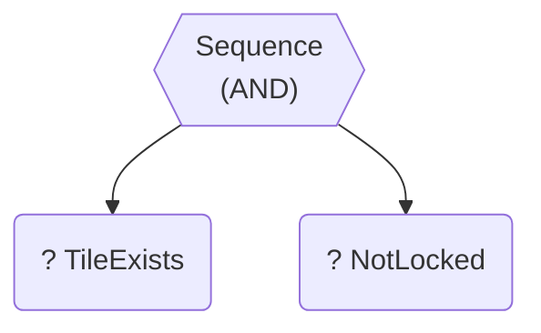
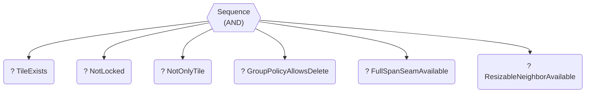
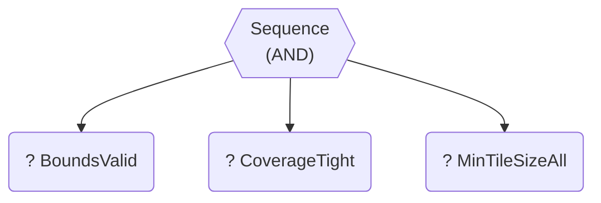
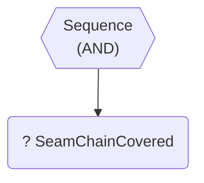
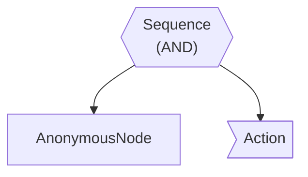
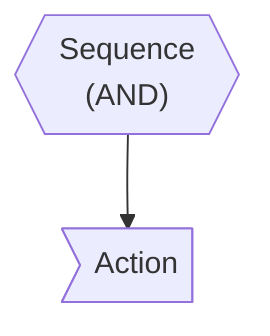

# Decision Engine Logic Tree

Auto-generated report of decision engine constraints and logic flow.

## Operation: `split`

### Logic Flow
- **Sequence** (All must pass)
  - 🔍 Condition: `TileExists`
  - 🔍 Condition: `NotLocked`

### Visual Graph

---

## Operation: `delete`

### Logic Flow
- **Sequence** (All must pass)
  - 🔍 Condition: `TileExists`
  - 🔍 Condition: `NotLocked`
  - 🔍 Condition: `NotOnlyTile`
  - 🔍 Condition: `GroupPolicyAllowsDelete`
  - 🔍 Condition: `FullSpanSeamAvailable`
  - 🔍 Condition: `ResizableNeighborAvailable`

### Visual Graph

---

## Operation: `insert`

### Logic Flow
- **Sequence** (All must pass)
  - 🔍 Condition: `TileExists`
  - 🔍 Condition: `NotLocked`

### Visual Graph

---

## Operation: `resize`

### Logic Flow
- **Sequence** (All must pass)
  - 🔍 Condition: `TileExists`
  - 🔍 Condition: `NotLocked`

### Visual Graph

---

## Operation: `validate`

### Logic Flow
- **Sequence** (All must pass)
  - 🔍 Condition: `BoundsValid`
  - 🔍 Condition: `CoverageTight`
  - 🔍 Condition: `MinTileSizeAll`

### Visual Graph

---

## Operation: `seam:resize`

### Logic Flow
- **Sequence** (All must pass)
  - 🔍 Condition: `SeamChainCovered`

### Visual Graph

---

## Operation: `interaction:hoverEdge`

### Logic Flow
- **Sequence** (All must pass)
  - *AnonymousNode*
  - ⚡ Action

### Visual Graph

---

## Operation: `interaction:keyTab`

### Logic Flow
- **Sequence** (All must pass)
  - ⚡ Action

### Visual Graph

---

## Operation: `interaction:commit`

### Logic Flow
- **Sequence** (All must pass)
  - ⚡ Action

### Visual Graph

---

## Operation: `interaction:hoverEnd`

### Logic Flow
- **Sequence** (All must pass)
  - ⚡ Action

### Visual Graph

---

