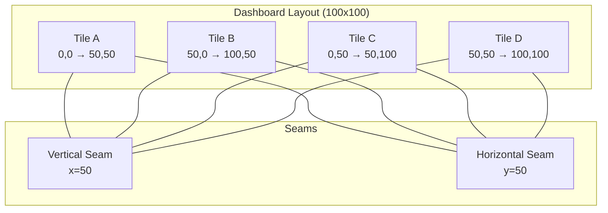
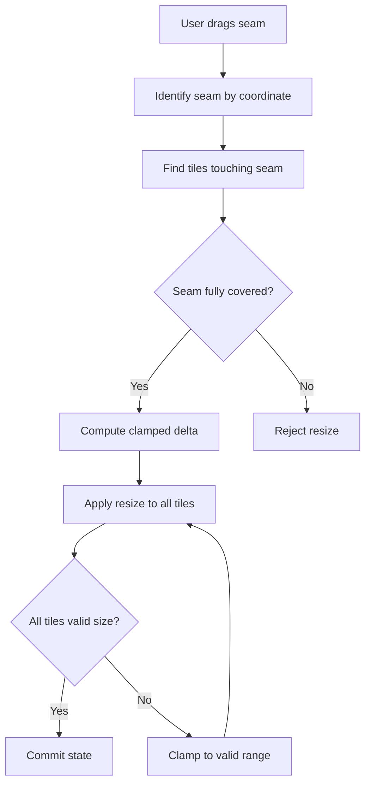
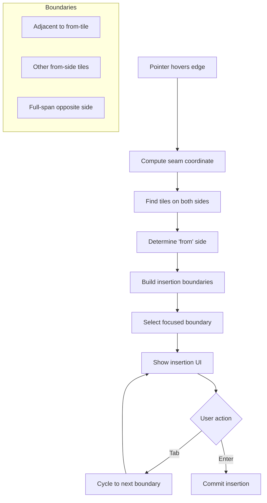

# Seam Concepts in Dashboarding

This document provides visual explanations of the seam-based layout system used in the dashboarding core.

## What is a Seam?

A **seam** is an invisible line where tiles meet. Seams are fundamental to how the layout system handles resize and insertion operations.

```
┌───────────────────────────────────────────────┐
│                                               │
│                    Tile A                     │
│                                               │
├───────────────────────────────────────────────┤  ← Horizontal Seam (y=50)
│                                               │
│                    Tile B                     │
│                                               │
└───────────────────────────────────────────────┘
```

In this example, there's a horizontal seam at y=50% where Tiles A and B meet.

## Seam Orientation

### Vertical Seams

Vertical seams run from top to bottom and separate tiles horizontally:

```
┌──────────────────────┬──────────────────────┐
│                      │                      │
│                      │                      │
│       Tile A         │       Tile B         │
│                      │                      │
│                      │                      │
└──────────────────────┴──────────────────────┘
                       ↑
              Vertical Seam (x=50)
```

### Horizontal Seams

Horizontal seams run from left to right and separate tiles vertically:

```
┌───────────────────────────────────────────────┐
│                    Tile A                     │
├───────────────────────────────────────────────┤ ← Horizontal Seam (y=33)
│                    Tile B                     │
├───────────────────────────────────────────────┤ ← Horizontal Seam (y=66)
│                    Tile C                     │
└───────────────────────────────────────────────┘
```

## Seam Chains

A **seam chain** is a connected sequence of seam segments at the same coordinate. When resizing, all tiles along a seam chain move together.

### Full-Span Seam Chain

```
┌──────────────────────┬──────────────────────┐
│                      │                      │
│       Tile A         │       Tile B         │
│                      │                      │
├──────────────────────┤                      │
│                      │                      │
│       Tile C         │                      │
│                      │                      │
└──────────────────────┴──────────────────────┘
                       ↑
          Vertical Seam at x=50
     (covers full height from y=0 to y=100)
```

### Partial Seam Segments

```
┌──────────────────────┬──────────────────────┐
│                      │                      │
│       Tile A         │       Tile B         │
│                      │                      │
├──────────────────────┼──────────────────────┤
│                      │                      │
│       Tile C         │       Tile D         │
│                      │                      │
└──────────────────────┴──────────────────────┘
         ↑                      ↑
    Seam at x=50           Seam at x=50
   (y=0 to y=50)          (y=50 to y=100)
```

Both segments form a continuous seam chain at x=50.

## Resize Operations

### Single Seam Resize

When dragging a seam, all tiles on both sides are affected:

```
Before:                              After (→ delta +10):
┌────────────┬──────────────┐       ┌──────────────┬────────────┐
│            │              │       │              │            │
│  Tile A    │    Tile B    │  ──→  │   Tile A     │  Tile B    │
│  (50%)     │    (50%)     │       │   (60%)      │  (40%)     │
│            │              │       │              │            │
└────────────┴──────────────┘       └──────────────┴────────────┘
```

### Chain Resize

Multiple tiles along a seam chain resize together:

```
Before:                              After (→ delta +10):
┌────────────┬──────────────┐       ┌──────────────┬────────────┐
│  Tile A    │    Tile B    │       │   Tile A     │  Tile B    │
│  (50%)     │    (50%)     │       │   (60%)      │  (40%)     │
├────────────┤              │  ──→  ├──────────────┤            │
│  Tile C    │              │       │   Tile C     │            │
│  (50%)     │              │       │   (60%)      │            │
└────────────┴──────────────┘       └──────────────┴────────────┘
```

Both A and C expand as the seam moves right.

## Seam Coverage

For a resize to be valid, the seam must be **covered** on both sides.

### Valid: Full Coverage

```
┌──────────────────────┬──────────────────────┐
│       Tile A         │       Tile B         │
├──────────────────────┤                      │
│       Tile C         │                      │
└──────────────────────┴──────────────────────┘

Left side:  A + C cover full height ✓
Right side: B covers full height ✓
→ Seam can be resized
```

### Invalid: Partial Coverage

```
┌──────────────────────┬──────────────────────┐
│       Tile A                │ Tile B        │
├────────────────────┬────────┴───────────────┤
│       Tile C       │       Tile D           │
└────────────────────┴────────────────────────┘

Seam at x=50 only touches A and C
→ Not a continuous chain, cannot be resized as one unit
```

## Insertion at Seams

### Adjacent Insertion

Insert a new tile by splitting the space of an adjacent tile:

```
Before:                              After (insert right of A):
┌──────────────────────┐            ┌───────────┬──────────────┐
│                      │            │           │              │
│       Tile A         │     ──→    │  Tile A   │  New Tile    │
│                      │            │           │              │
└──────────────────────┘            └───────────┴──────────────┘
```

### Full-Span Insertion

Insert a tile that spans the full width/height at a seam:

```
Before:                              After (full-span insert below):
┌──────────────┬───────────────┐    ┌──────────────┬───────────────┐
│              │               │    │              │               │
│    Tile A    │    Tile B     │    │    Tile A    │    Tile B     │
│              │               │    │              │               │
├──────────────┴───────────────┤    ├──────────────┴───────────────┤
│          Tile C              │    │          New Tile            │
│                              │    ├──────────────────────────────┤
│                              │    │          Tile C              │
└──────────────────────────────┘    └──────────────────────────────┘
```

## Mermaid Diagrams

### Seam Structure



### Resize Decision Flow



### Insertion Boundary Selection



## Seam ID Format

Seams are identified by their orientation and coordinate:

| Orientation | Coordinate | ID Example           |
| ----------- | ---------- | -------------------- |
| Vertical    | x=50       | `seam\|v\|50.000000` |
| Horizontal  | y=33.33    | `seam\|h\|33.330000` |

The coordinate is formatted to 6 decimal places for consistent comparison.

## Key Concepts Summary

| Concept         | Description                                      |
| --------------- | ------------------------------------------------ |
| **Seam**        | Line where tiles meet                            |
| **Orientation** | Vertical (left/right) or Horizontal (top/bottom) |
| **Seam Chain**  | Connected segments at same coordinate            |
| **Coverage**    | Whether tiles fully span the seam                |
| **Clamping**    | Limiting resize delta to maintain min tile size  |
| **Boundary**    | Insertion point at a seam segment                |

## Related Documentation

- [Architecture Overview](./architecture.md) - System design and package structure
- [Decision Engine](./decision_engine_tree.md) - Constraint validation system
- [Plugin Development](./plugin-development-guide.md) - Extending the core
- [Strategy Extension](./strategy-extension-guide.md) - Custom resize/split/delete logic
